# We Do

We Do is a wedding management platform built with React. It includes vendor recommendations and booking, budget tracker, user profile management, and guest management.

## Contributors
- Noam Mualmi (nonomu)
- Ron Braha (RNR1)
- Yaniv Sultan (yanivsultan)
- Guy Dahan (GuyDahn)
- Ori Tsadok (oritsadok)

## Table Of Contents
- [We Do](#we-do)
  - [Contributors](#contributors)
  - [Table Of Contents](#table-of-contents)
  - [Running the project](#running-the-project)
  - [Screenshots](#screenshots)
    - [Home](#home)
    - [Register](#register)
    - [Login](#login)
    - [Profile](#profile)
    - [Vendors](#vendors)
    - [Favorites](#favorites)
    - [Vendor info](#vendor-info)
    - [Book vendor](#book-vendor)
    - [Budget tracker](#budget-tracker)
    - [Guest management](#guest-management)
    - [Add table](#add-table)
    - [Table management](#table-management)
  - [Tech-stack](#tech-stack)

## Running the project
1. Clone the repo.
2. Run `npm install`.
3. Run `node server.js`.
4. Run `mysql`.
5. Navigate to `http://localhost:3000`.

## Screenshots

### Home
A short introduction to the platform. The user can navigate to registration or login form via the navigation bar

### Register
Registration form. User can input personal and wedding information.

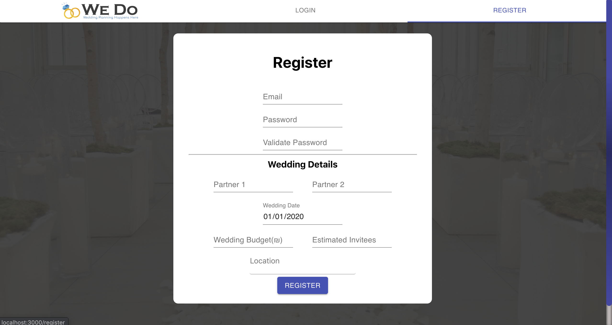

### Login

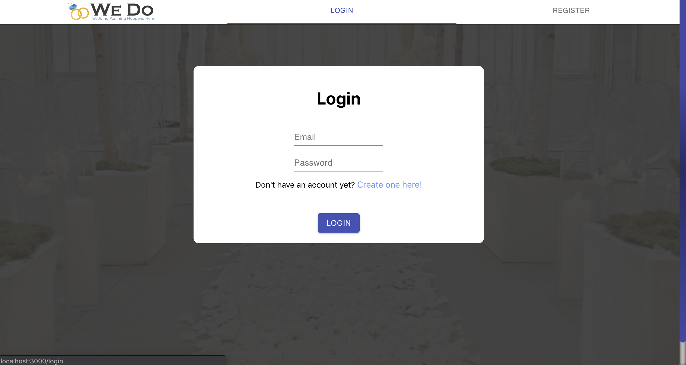

### Profile
Update and view user profile information.

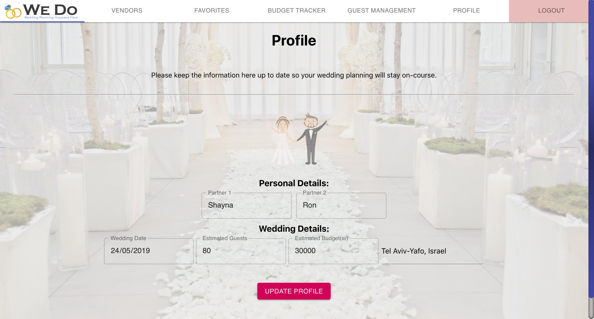

### Vendors
Get vendor recommendations, add vendors to favorites, book vendor for wedding. Clicking on a vendor will redirect to a more detailed dialog box.

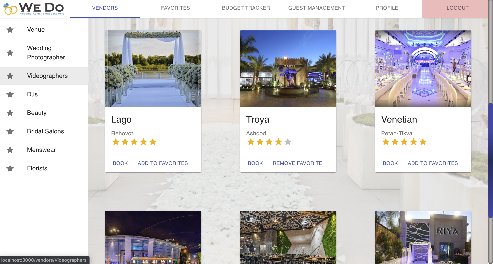

### Favorites
View favorite vendors in one place.

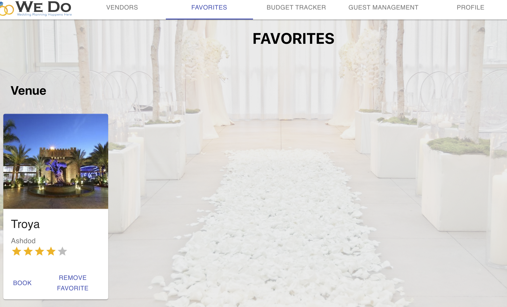

### Vendor info

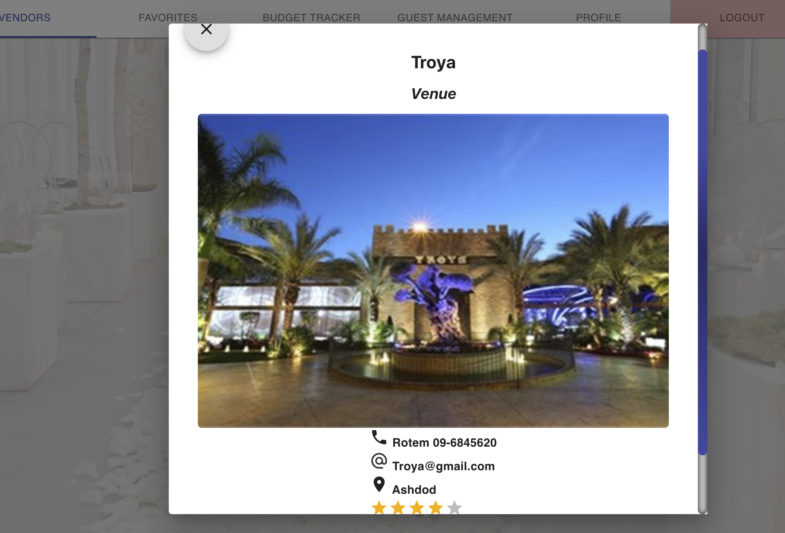

### Book vendor
Vendor booking screen. Users have to input the price they paid for that vendor so it will be added to their budget tracker.

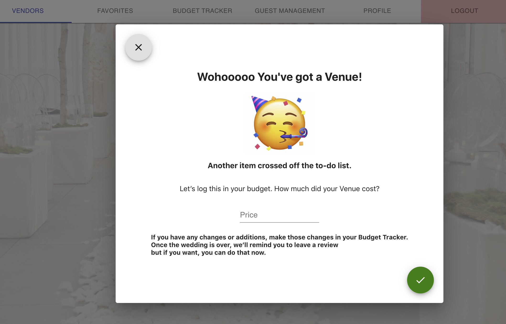

### Budget tracker
Get an overview of all booked vendors for the wedding. Review total budget and how much of it was spent already.

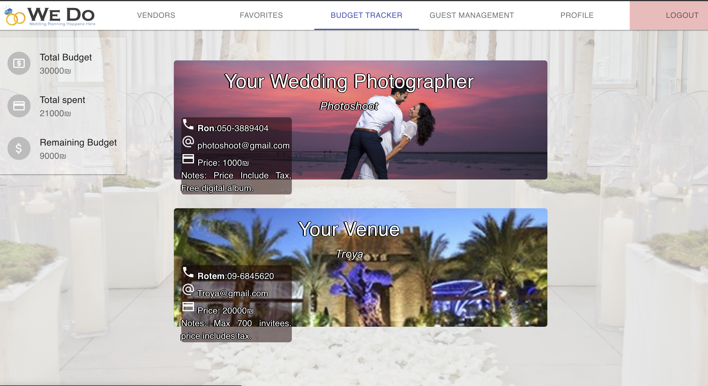

### Guest management
Manage guest list for the wedding. Clicking the + button will open a dialog box for adding a new table, so user can manage their table setting. 

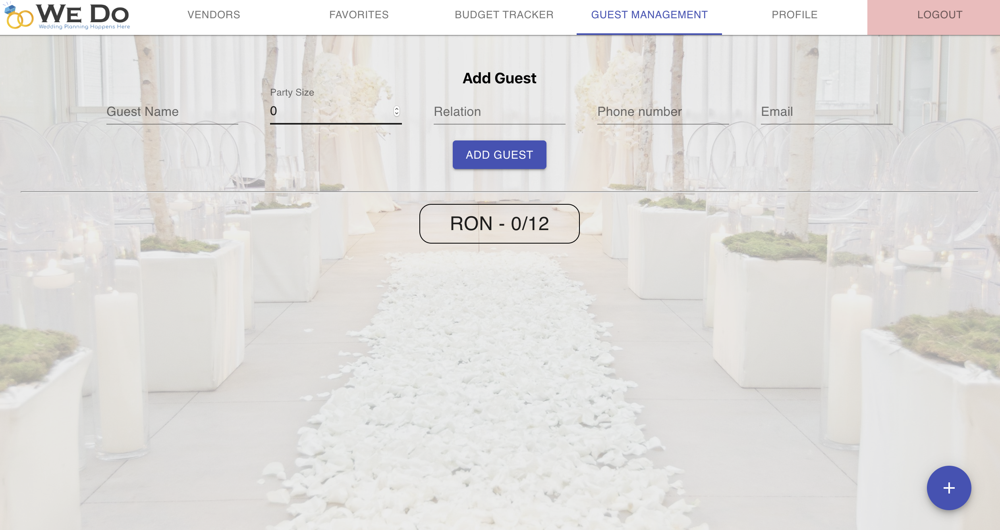

### Add table

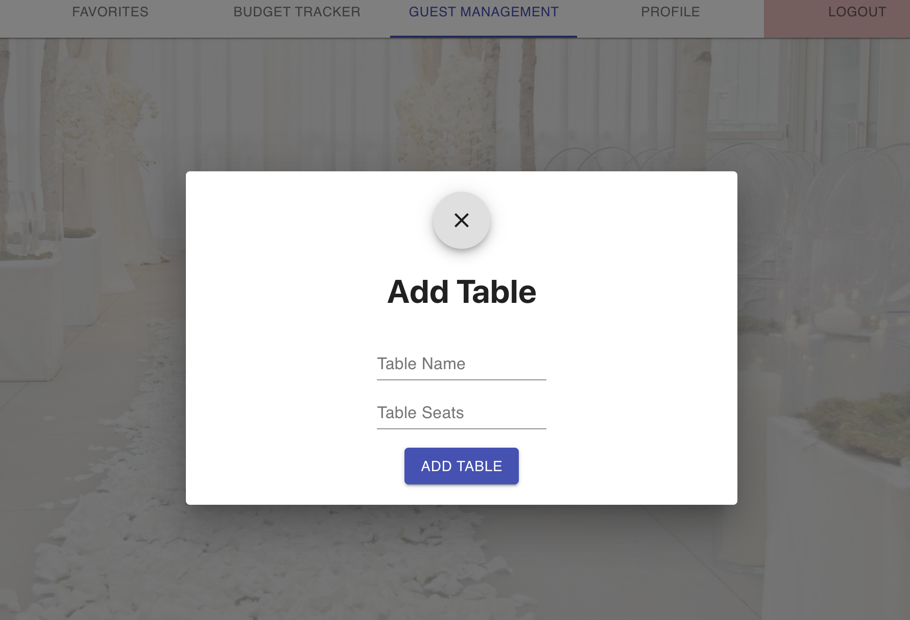

### Table management
Add or remove guests from a table.

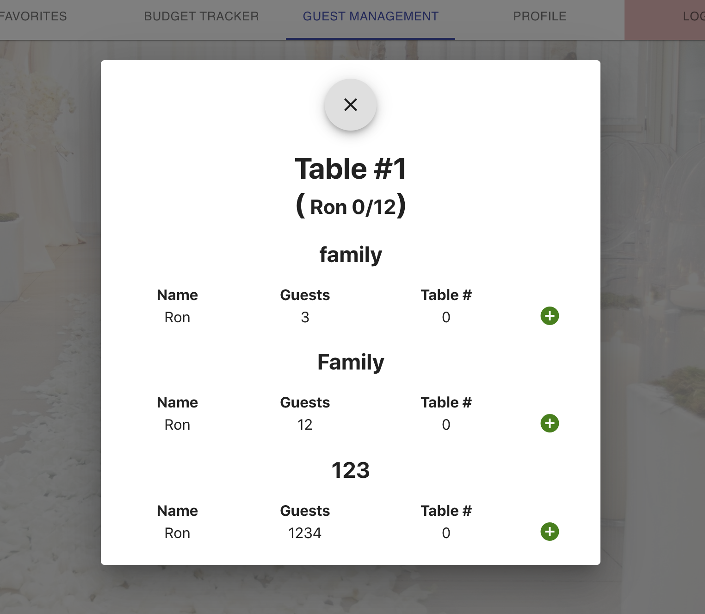

## Tech-stack
1. React, MobX, Material-UI, React-Toastify and Axios.
2. Express (Node.js), Sequelize (MySQL), bcrypt.